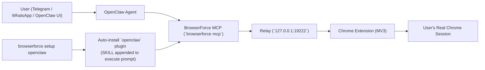

# BrowserForce // Parallel AI Agents in "your" Browser!

Give AI agents controlled access to the browser you already use.

> "a lion doesn't concern itself with token counting" — [@steipete](https://x.com/steipete), creator of [OpenClaw](https://github.com/openclaw/openclaw)
>
> "a 10x user doesn't concern itself with sandboxed browsers // sandboxes are for kids" — BrowserForce, your friendly neighborhood power source.

**You're giving an AI your real Chrome — your logins, cookies, and sessions. That takes conviction.** BrowserForce is built for people who use the best models and don't look back. Security is built in: lock URLs, block navigation, read-only mode, auto-cleanup — you stay in control.

**Autonomous when you want it, controlled when you need it.** Your agent can run hands-off in Auto mode, or you can switch to Manual mode and explicitly attach only the tabs you trust. BrowserForce connects to **your running browser** with one Chrome extension and full Playwright API support.

Works with [OpenClaw](https://github.com/openclaw/openclaw), Claude, or any MCP-compatible agent.

## Why BrowserForce?


|                | Playwright MCP       | OpenClaw Browser        | Playwriter              | Claude Extension     | BrowserForce                         |
| -------------- | -------------------- | ----------------------- | ----------------------- | -------------------- | ------------------------------------ |
| Browser        | Spawns new Chrome    | Separate profile        | Your Chrome             | Your Chrome          | **Your Chrome**                      |
| Login state    | Fresh                | Fresh (isolated)        | Yours                   | Yours                | **Yours**                            |
| Tab access     | N/A (new browser)    | Managed by agent        | Click each tab          | Click each tab       | **Auto mode + manual attached tabs** |
| Autonomous     | Yes                  | Yes                     | No (manual click)       | No (manual click)    | **Yes (fully autonomous)**           |
| Context method | Screenshots (100KB+) | Screenshots + snapshots | A11y snapshots (5-20KB) | Screenshots (100KB+) | **A11y snapshots (5-20KB), also support screenshots**          |
| Tools          | Many dedicated       | 1 `browser` tool        | 1 `execute` tool        | Built-in             | **2 tools: `execute`, `reset` + extend via plugins**      |
| Agent support  | Any MCP client       | OpenClaw only           | Any MCP client          | Claude only          | **Any MCP client**                   |
| Playwright API | Partial              | No                      | Full                    | No                   | **Full**                             |


## Your Credentials Stay Yours

Every other approach asks you to hand over something: an API key, an OAuth token, stored passwords, session cookies in a config file. BrowserForce asks for none of it.

**Why?** Because you're already logged in. BrowserForce talks to your running Chrome — it doesn't extract credentials, store cookies, or replay tokens. The browser handles auth exactly as it always has. Your agent inherits your sessions the same way a new Chrome tab does.

What you never need to provide:

- No passwords
- No API keys
- No OAuth tokens
- No session cookies in env vars or config files

It's a security win *and* a setup win — there are no secrets to rotate, leak, or manage. Your logins live in Chrome. They stay in Chrome.

## Setup

### 1. Install

```bash
npm install -g browserforce
```

Or from source:

```bash
git clone https://github.com/ivalsaraj/browserforce.git
cd browserforce
pnpm install
```

### 2. Load the Chrome extension

**If you installed via npm:**

1. Run: `browserforce install-extension` — note the path it prints (e.g. `/Users/you/.browserforce/extension`)
2. Open `chrome://extensions/` in Chrome
3. Enable **Developer mode** (top-right toggle)
4. Click **Load unpacked** → a file picker opens
  - **macOS**: press `Cmd+Shift+G`, paste the path from step 1, press Enter
  - **Windows/Linux**: paste the path directly into the address bar of the dialog

❗ After every BrowserForce update, re-run `browserforce install-extension`, then reload the extension in `chrome://extensions/` (click the ↺ icon next to BrowserForce).

**If you cloned the repo:**

1. Open `chrome://extensions/` in Chrome
2. Enable **Developer mode** (top-right toggle)
3. Click **Load unpacked** → select the `extension/` folder

After loading, the extension icon appears in your toolbar (gray = disconnected).

### 3. Done

The relay auto-starts when you run any command or connect via MCP — no manual step needed. Extension icon turns green once connected.

To run the relay manually (optional):

```bash
browserforce serve
```

## Connect Your Agent

### OpenClaw

Most OpenClaw users chat with their agent from Telegram or WhatsApp. BrowserForce lets your agent browse the web as you — no login flows, no captchas — even from a messaging app.

#### OpenClaw One-Time Setup

```bash
npm install -g browserforce
browserforce install-extension
browserforce setup openclaw
```

`setup openclaw` now auto-installs the official `openclaw` BrowserForce plugin into `~/.browserforce/plugins/openclaw/` so OpenClaw gets BrowserForce-specific usage policy without affecting other agents.

Optional: install the BrowserForce skill for your OpenClaw agent (scoped to OpenClaw only):

```bash
npx -y skills add ivalsaraj/browserforce --agent openclaw --skill browserforce --yes
```

Preview only (no install):

```bash
npx -y skills add ivalsaraj/browserforce --list
```

#### Autostart Modes

- `Default wrapper mode`: `setup openclaw` writes an OpenClaw MCP server entry that starts `browserforce serve` on-demand before `browserforce mcp`.
- `Always-on daemon mode`: `setup openclaw` also installs OS autostart by default (launchd on macOS, systemd user service on Linux, scheduled task on Windows) so relay is already running after login.
- `No daemon registration mode`: run `browserforce setup openclaw --no-autostart` to skip OS login service/daemon registration only; MCP wrapper autostart-on-demand still runs `browserforce serve` before `browserforce mcp`.

Setup flags:
- `--dry-run`: preview OpenClaw/autostart changes without writing files.
- `--json`: print machine-readable setup output.
- `--no-autostart`: skip OS login service/daemon registration only; wrapper autostart-on-demand stays enabled.

Opt-in install automation environment variables:

```bash
BROWSERFORCE_SETUP_OPENCLAW=1
BROWSERFORCE_SETUP_OPENCLAW_FORCE=1
BROWSERFORCE_SETUP_OPENCLAW_APPLY=1
```

When enabled, package install runs `setup openclaw --dry-run --json`; adding `BROWSERFORCE_SETUP_OPENCLAW_APPLY=1` also runs `setup openclaw --json`. In CI, `BROWSERFORCE_SETUP_OPENCLAW_FORCE=1` is required for the setup hook to run.

Then start the relay (only needed if you want to run it manually):

```bash
browserforce serve
```

**Verify it works** — send this to your agent:

> Go to [https://x.com](https://x.com) and give me top tweets

If your agent browses to the page and responds with the title, you're all set.

#### OpenClaw + BrowserForce Flow



**MCP setup (advanced):**

<details>
<summary><b>OpenClaw (MCP adapter)</b></summary>

Add to `~/.openclaw/openclaw.json`:

```json
{
  "plugins": {
    "entries": {
      "mcp-adapter": {
        "enabled": true,
        "config": {
          "servers": [
            {
              "name": "browserforce",
              "transport": "stdio",
              "command": "sh",
              "args": ["-lc", "if ! lsof -tiTCP:19222 -sTCP:LISTEN >/dev/null 2>&1; then npx -y browserforce@latest serve >/dev/null 2>&1 & fi; exec npx -y browserforce@latest mcp"]
            }
          ]
        }
      }
    }
  }
}
```

This wrapper-style entry auto-starts the relay on demand. Manual/non-wrapper alternative: use `npx -y browserforce@latest mcp` and keep `browserforce serve` running yourself.

</details>

<details>
<summary><b>Claude Desktop</b></summary>

Add to `~/Library/Application Support/Claude/claude_desktop_config.json`:

```json
{
  "mcpServers": {
    "browserforce": {
      "command": "npx",
      "args": ["-y", "browserforce@latest", "mcp"]
    }
  }
}
```

</details>

<details>
<summary><b>Claude Code</b></summary>

Add to `~/.claude/mcp.json`:

```json
{
  "mcpServers": {
    "browserforce": {
      "command": "npx",
      "args": ["-y", "browserforce@latest", "mcp"]
    }
  }
}
```

</details>

<details>
<summary><b>Codex</b></summary>

Add to `~/.codex/config.toml`:

```toml
[mcp_servers.browserforce]
command = "npx"
args = ["-y", "browserforce@latest", "mcp"]
```

</details>

<details>
<summary><b>Cursor</b></summary>

Add to `~/.cursor/mcp.json`:

```json
{
  "mcpServers": {
    "browserforce": {
      "command": "npx",
      "args": ["-y", "browserforce@latest", "mcp"]
    }
  }
}
```

</details>

<details>
<summary><b>Antigravity</b></summary>

In Antigravity: Agent panel -> `...` -> `Manage MCP Servers` -> `View raw config`.
Add the same `mcpServers` entry:

```json
{
  "mcpServers": {
    "browserforce": {
      "command": "npx",
      "args": ["-y", "browserforce@latest", "mcp"]
    }
  }
}
```

</details>

<details>
<summary><b>Client Mode: multi-client (default) vs single-active</b></summary>

BrowserForce has two relay client arbitration modes:

- `multi-client` (default): allows multiple MCP/CDP clients at the same time.
Use this for normal browsing, read-heavy research, and parallel workflows across tools.
- `single-active`: allows only one active MCP/CDP client slot at a time.
Use this for sensitive or write-heavy workflows where you need deterministic single-owner control.

When `single-active` is enabled, additional clients get `409 Conflict` while the slot is busy, and can wait/retry using `/client-slot`.

Set mode in the MCP server command:

- Explicit default mode: `env BF_CLIENT_MODE=multi-client npx -y browserforce@latest mcp`
- Single-owner mode: `env BF_CLIENT_MODE=single-active npx -y browserforce@latest mcp`

Examples below use the POSIX `env` wrapper. If your MCP client supports an `env` map, set `BF_CLIENT_MODE` there instead.

**OpenClaw (MCP adapter):**

```json
{
  "plugins": {
    "entries": {
      "mcp-adapter": {
        "enabled": true,
        "config": {
          "servers": [
            {
              "name": "browserforce",
              "transport": "stdio",
              "command": "env",
              "args": ["BF_CLIENT_MODE=single-active", "npx", "-y", "browserforce@latest", "mcp"]
            }
          ]
        }
      }
    }
  }
}
```

**Claude Desktop / Claude Code / Cursor / Antigravity:**

```json
{
  "mcpServers": {
    "browserforce": {
      "command": "env",
      "args": ["BF_CLIENT_MODE=single-active", "npx", "-y", "browserforce@latest", "mcp"]
    }
  }
}
```

**Codex (`~/.codex/config.toml`):**

```toml
[mcp_servers.browserforce]
command = "env"
args = ["BF_CLIENT_MODE=single-active", "npx", "-y", "browserforce@latest", "mcp"]
startup_timeout_sec = 45
```

</details>


If MCP startup fails with `connection closed: initialize response`:

1. Ensure args include `"mcp"` (without it, BrowserForce prints help and exits).
2. If running from a local clone, install deps first: `pnpm install`.
3. Validate the launch command manually: `npx -y browserforce@latest mcp`

### CLI

```bash
npm install -g browserforce   # or: pnpm add -g browserforce
```

```bash
browserforce serve              # Start the relay server
browserforce status             # Check relay and extension status
browserforce tabs               # List open browser tabs
browserforce snapshot [n]       # Accessibility tree of tab n
browserforce screenshot [n]     # Screenshot tab n (PNG to stdout)
browserforce navigate <url>     # Open URL in a new tab
browserforce -e "<code>"        # Run Playwright JavaScript (one-shot)
browserforce plugin list        # List installed plugins
browserforce plugin install <n> # Install a plugin from the registry
browserforce plugin remove <n>  # Remove an installed plugin
browserforce setup openclaw [--dry-run] [--json] [--no-autostart] # Configure OpenClaw + optional autostart
browserforce update             # Update to the latest version
browserforce install-extension  # Copy extension to ~/.browserforce/extension/
```

Setup flags: `--dry-run` (preview), `--no-autostart` (skip OS login daemon/service registration only), `--json` (machine-readable output).

Each `-e` command is one-shot — state does not persist between calls. For persistent state, use the MCP server.


## Deep Dive Sections

The core onboarding above stays visible. The sections below keep full detail, organized with progressive disclosure.

<details>
<summary><b>Plugins (Install, Official, Usage, Manage, Authoring)</b></summary>

## Plugins

Plugins add custom helpers directly into the `execute` tool scope. Install once — your agent calls them like built-in functions.

### Install a plugin

```bash
browserforce plugin install highlight
```

That's it. Restart MCP (or Claude Desktop) and `highlight()` is available in every `execute` call.

### Official plugins


| Plugin      | What it adds                                                                                   | Install                                 |
| ----------- | ---------------------------------------------------------------------------------------------- | --------------------------------------- |
| `highlight` | `highlight(selector, color?)` — outlines matching elements; `clearHighlights()` — removes them | `browserforce plugin install highlight` |
| `google-sheets` | `gsReadContiguousRows()`; `gsFormatBulletsInRange()`; `gsSplitBulletsInRange()`; `gsRebalanceBoldInRange()`; `gsLogIssue()` | `browserforce plugin install google-sheets` |
| `openclaw`  | OpenClaw-specific BrowserForce tab policy (skill text only, no helper functions)              | Auto-installed by `browserforce setup openclaw` |


### Use an installed plugin

After installing `highlight`, your agent can call it directly:

```javascript
// Outline all buttons in blue
await highlight('button', 'blue');

// Highlight the specific element you're about to click
await highlight('[data-testid="submit"]', 'red');
return await screenshotWithAccessibilityLabels();
```

The helper receives the active page, context, and state automatically — no plumbing needed.

### Manage plugins

```bash
browserforce plugin list        # See what's installed
browserforce plugin remove highlight   # Uninstall
```

Plugins are stored at `~/.browserforce/plugins/`. Each one is a folder with an `index.js`.

### Write your own

```javascript
// ~/.browserforce/plugins/my-plugin/index.js
export default {
  name: 'my-plugin',
  helpers: {
    async scrollToBottom(page, ctx, state) {
      await page.evaluate(() => window.scrollTo(0, document.body.scrollHeight));
    },
    async countLinks(page, ctx, state) {
      return page.evaluate(() => document.querySelectorAll('a').length);
    },
  },
};
```

Drop it in `~/.browserforce/plugins/my-plugin/`, restart MCP, and call `await scrollToBottom()` or `await countLinks()` from any `execute` call.

Add a `SKILL.md` file alongside `index.js` and its content is automatically appended to the `execute` tool's description — so your agent knows the helpers exist without you having to explain them every time.

### Any Playwright Script

```javascript
const { chromium } = require('playwright');

const browser = await chromium.connectOverCDP(
  'ws://127.0.0.1:19222/cdp?token=<TOKEN>'
);

const pages = browser.contexts()[0].pages();
for (const page of pages) {
  console.log(page.url());  // your real tabs!
}

// Gmail is already logged in
const gmail = pages.find(p => p.url().includes('mail.google'));
await gmail.screenshot({ path: 'gmail.png' });
```

No token config needed for MCP — the server reads it automatically from `~/.browserforce/cdp-url`.


</details>

<details>
<summary><b>Agent Capabilities (Tools, Helpers, Swarms)</b></summary>

## What Your Agent Can Do

Once connected, your agent has full Playwright access to your real browser:

```javascript
// Navigate (uses your cookies — no login needed)
await page.goto('https://github.com');
await waitForPageLoad();

// Read pages with accessibility snapshots (10-100x cheaper than screenshots)
return await snapshot();

// Click, type, fill forms
await page.locator('role=button[name="Sign in"]').click();
await page.locator('role=textbox[name="Search"]').fill('query');

// Screenshots when you need them
return await page.screenshot();

// Work with multiple tabs
const pages = context.pages();
const gmail = pages.find(p => p.url().includes('mail.google'));

// Persist data across calls
state.results = await page.evaluate(() => document.title);
```

### MCP Tools


| Tool      | Description                                                                                                                                                                                                                    |
| --------- | ------------------------------------------------------------------------------------------------------------------------------------------------------------------------------------------------------------------------------ |
| `execute` | Run Playwright JavaScript in your real Chrome. Access `page`, `context`, `state`, `snapshot()`, `waitForPageLoad()`, `getLogs()`, `screenshotWithAccessibilityLabels()`, `cleanHTML()`, `pageMarkdown()`, and Node.js globals. |
| `reset`   | Reconnect to the relay and clear state. Use when the connection drops.                                                                                                                                                         |


### Diff-Aware Helpers

Use `showDiffSinceLastCall` to control diff output vs full output in execute helper calls:

```javascript
await snapshot({ showDiffSinceLastCall: true });
await snapshot({ showDiffSinceLastCall: false });
await cleanHTML('body', { showDiffSinceLastCall: false });
await pageMarkdown({ showDiffSinceLastCall: true });
```

### BrowserForce Tab Swarms // Parallel Tabs Processing

BrowserForce uses a parallel-first policy for independent extraction jobs, so agents finish list/count/scrape tasks faster with bounded risk.

- Rule: For count/list/extraction across independent pages, dates, or items, run parallel tabs first using `Promise.all` with a concurrency cap (`3-8`, typically start at `5`).
- Fallback: If the site starts rate-limiting (`429`), anti-bot challenges appear, or timeouts repeat, automatically retry with reduced concurrency and then sequential as a final fallback.
- Safety: This swarm exception is for read-only bulk extraction only; no user-tab mutation (checkout/purchase/send/delete/settings changes) during swarm runs.
- Required telemetry return: `peakConcurrentTasks`, `wallClockMs`, `sumTaskDurationsMs`, `failures`, `retries`.

Need role-based, real workflows? See [Actionable Use Cases](docs/USE_CASES.md).


</details>

<details>
<summary><b>Examples and Multi-Tab Workflows</b></summary>

## Examples

Get started with simple prompts. The AI generates code and does the work.

**Example 1: Read page content (X.com search)**

**Prompt to AI:**

> Go to x.com/search and search for "browserforce". Show me the top 5 tweets you find.

**What the AI does:** Navigates to X, searches the term, extracts top tweets, returns them to you.

**Use case:** Quick research, trend tracking, social listening.


**Example 2: Interact with a form (GitHub search)**

**Prompt to AI:**

> Go to GitHub and search for "ai agents". Show me the top 3 repositories and their star counts.

**What the AI does:** Fills GitHub search, waits for results, extracts repo names + stars, returns them.

**Use case:** Finding libraries, competitive research, project discovery.


### Multi-Tab Workflows

**Example 3: Search → Extract → Return**

**Prompt to AI:**

> Search ProductHunt for "AI tools" and give me the top 5 products with their taglines and upvote counts.

**What the AI does:** Navigates ProductHunt, searches, extracts product info, returns structured data.

**Use case:** Market research, finding tools, competitive analysis.


**Example 4: Open result in new tab, process there**

**Prompt to AI:**

> Find the #1 product from your last ProductHunt search, click into it, and read the full description. Tell me what it does.

**What the AI does:** Opens the product page from previous results, reads the description, summarizes it.

**Use case:** Deep-dive research, understanding competitors, due diligence.


**Example 5: Debugging workflow (inspect + verify)**

**Prompt to AI:**

> Go to my staging site at staging.myapp.com/checkout and take a labeled screenshot. Tell me if the "Complete Purchase" button is visible and what's around it.

**What the AI does:** Navigates, takes screenshot with interactive labels, analyzes button state and layout.

**Use case:** Visual debugging, QA checks, spotting broken elements.


**Example 6: Test form with data**

**Prompt to AI:**

> Sign up for Substack using the email [test.user@example.com](mailto:test.user@example.com). Tell me if the signup completes successfully.

**What the AI does:** Fills the form, submits, waits for confirmation, reports success/failure.

**Use case:** Testing sign-up flows, QA automation, form validation.


**Example 7: Content pipeline (search → extract → compare)**

**Prompt to AI:**

> Search for "AI regulation" on both X.com and LinkedIn. Give me the top 5 trending posts from each and tell me which topics overlap.

**What the AI does:** Searches both platforms, extracts posts, compares content, returns analysis.

**Use case:** Multi-source research, trend analysis, market sentiment.


**Example 8: Data extraction → CSV pipeline**

**Prompt to AI:**

> Go to Hacker News and extract the top 10 stories with their titles and vote counts. Format as CSV so I can import into a spreadsheet.

**What the AI does:** Navigates HN, extracts story data, formats as CSV, returns it ready to paste.

**Use case:** Data workflows, trend tracking, content curation.


**Example 9: A/B testing across variants**

**Prompt to AI:**

> Visit myapp.com/?variant=red and myapp.com/?variant=blue. Compare the two designs and tell me which button color is more prominent and what other differences exist.

**What the AI does:** Opens both variants, compares layouts/colors/text, reports visual differences.

**Use case:** Design QA, A/B testing, variant comparison.


**Example 10: Monitor + alert workflow**

**Prompt to AI:**

> Check our status page at status.myapp.com every few minutes. Tell me the current status of the API and database. Alert me if anything changes from green to red.

**What the AI does:** Monitors status page, reads indicators, alerts on degradation.

**Use case:** Uptime monitoring, incident detection, SLA tracking.


### Parallel Tab Swarms: Real-World Use Cases

**Example 11: Retail price swarm (SKU × store matrix)**

**Prompt to AI:**

> For these 25 SKUs, check Amazon, Walmart, Target, and Best Buy in parallel tabs. Return the best price, in-stock status, and fastest delivery ETA per SKU.

**What the AI does:** Runs independent `(sku, store)` checks in capped parallel tab batches, retries with reduced concurrency on `429`/timeouts, then falls back sequentially if needed.

**Use case:** Pricing intelligence, buy-box monitoring, merchandising ops.


**Example 12: Travel fare grid (date × route sweep)**

**Prompt to AI:**

> For SFO → JFK, scan the next 14 Fridays and Sundays across Google Flights, Kayak, and Expedia. Return the cheapest refundable option for each date.

**What the AI does:** Opens independent `(date, site)` tasks in parallel, extracts fare + refundability, and returns a normalized comparison table.

**Use case:** Travel operations, procurement, rapid itinerary optimization.


**Example 13: Competitor launch radar (company × source)**

**Prompt to AI:**

> Track the last 7 days of updates for these 30 competitors across release notes, changelogs, docs, and blog posts. Group findings by feature category.

**What the AI does:** Parallelizes `(company, source)` extraction, deduplicates announcements, and returns a launch digest with links.

**Use case:** Product strategy, PM intelligence, competitive monitoring.


**Example 14: Lead qualification swarm (account × signal source)**

**Prompt to AI:**

> For this account list, check careers pages, LinkedIn jobs, pricing pages, and press/news for expansion signals. Score each account and rank top opportunities.

**What the AI does:** Executes independent account-source checks in parallel tabs, extracts signal evidence, and returns ranked lead scores with rationale.

**Use case:** Sales research, outbound prioritization, RevOps signal mining.


**Example 15: Security exposure triage (domain × surface)**

**Prompt to AI:**

> For these domains, inspect login pages, robots.txt, status pages, public docs, and likely staging links. Flag suspicious exposures with evidence links.

**What the AI does:** Runs read-only `(domain, surface)` checks in a swarm, retries degraded paths safely, and returns a risk-prioritized findings report.

**Use case:** Security reviews, surface mapping, pre-audit triage.


**More examples** and detailed walkthrough available in the [User Guide](GUIDE.md#examples).


</details>

<details>
<summary><b>Architecture, Control, Security, Configuration, API</b></summary>

## How It Works

```mermaid
flowchart TD
  AGENT["Agent (OpenClaw, Claude, Codex, etc.)"] --> MCP["MCP Server (`browserforce mcp`)"]
  AGENT --> CLI["CLI (`browserforce -e`)"]
  MCP --> RELAY["Relay Server (`127.0.0.1:19222`)"]
  CLI --> RELAY
  RELAY --> EXT["Chrome Extension (MV3 Service Worker)"]
  EXT --> CDP["`chrome.debugger` bridge"]
  CDP --> BROWSER["User's Real Chrome Browser"]
```

The **relay server** runs on your machine (localhost only). It translates between the agent's CDP commands and the extension's debugger bridge.

The **Chrome extension** lives in your browser. It attaches Chrome's built-in debugger to permitted tabs and forwards commands — exactly like DevTools does.

In **Auto mode**, the agent can create and control tabs it opens. In **Manual mode**, you decide access by clicking **+ Attach Current Tab**.

## You Stay in Control

Click the extension icon to configure restrictions. Your browser, your rules:


| Setting                 | What it does                                                             |
| ----------------------- | ------------------------------------------------------------------------ |
| **Auto / Manual mode**  | Let the agent create tabs freely, or hand-pick which tabs it can access  |
| **Execution mode**      | `parallel` for independent work, `sequential` for one-at-a-time workflows |
| **Parallel visibility** | `foreground-tab` keeps new tabs visible in the current window             |
| **Lock URL**            | Prevent the agent from navigating away from the current page             |
| **No new tabs**         | Block the agent from opening new tabs                                    |
| **Read-only**           | Observe only — no clicks, no typing, no interactions                     |
| **Auto-detach**         | Automatically detach inactive tabs after 5-60 minutes                    |
| **Auto-close**          | Automatically close agent-created tabs after 5-60 minutes                |
| **Custom instructions** | Pass text instructions to the agent (e.g. "don't click any buy buttons") |

`parallelVisibilityMode` is currently enforced as `foreground-tab` (visible tabs in the active window, no new windows). If `rotate-visible` is selected, BrowserForce normalizes to `foreground-tab` in this release.

### Execution Strategy Preferences

- **Visible parallel with current-window tabs (`foreground-tab`)**: New agent tabs open visibly in your current Chrome window and stay there.
- **Sequential mode (`executionMode = sequential`)**: Useful for lower-noise, step-by-step workflows on sensitive sites.
- **Rotate-visible demo mode (`rotate-visible`)**: Temporarily normalized to `foreground-tab` while the visibility lock is enforced.

MCP reads `executionMode` and `parallelVisibilityMode` once per MCP session and caches them. If you change popup settings mid-session, call `reset` to refresh settings for new execute calls.


### Controlled Tab Workflows

- **Manually attach a tab:** Open the tab you want, click the extension popup, then click **+ Attach Current Tab**.
- **Open full log viewer:** In the popup, click **View Full Logs** to open the extension options page.
- **Restrict to one controlled tab:** Use **Manual mode**, attach one tab, and enable **No new tabs**.
- **Allow multiple controlled tabs:** Stay in **Manual mode** and attach each tab you want the agent to access.
- **Restriction modes:** Use **Lock URL** (no navigation), **No new tabs**, and **Read-only** (observe only) together or separately.
- **Auto-cleanup:** Use **Auto-detach** for inactive attached tabs and **Auto-close** for agent-created tabs.

For step-by-step setups, see the [Controlled Tabs Playbook](GUIDE.md#controlled-tabs-playbook).

## Security


| Layer            | Control                                                                 |
| ---------------- | ----------------------------------------------------------------------- |
| **Network**      | Relay binds to `127.0.0.1` only — never exposed to the internet         |
| **Auth**         | Random token required for every CDP connection                          |
| **Origin**       | Extension only accepts connections from its own Chrome origin           |
| **Visibility**   | Chrome shows "controlled by automated test software" on active tabs     |
| **Restrictions** | Lock URLs, block navigation, read-only mode — enforced at the CDP level |


Everything runs on your machine. The auth token is stored at `~/.browserforce/auth-token` with owner-only permissions.

## Configuration

### Port conflicts and switching ports

Default port is `19222`.

If that port is already in use, you can see:
- relay start failure (`EADDRINUSE` / port in use)
- extension stays disconnected (gray)
- MCP errors like `Extension not connected`

Switch all components to the same new port (example: `19333`):

1. Start relay on the new port:

```bash
RELAY_PORT=19333 browserforce serve
```

2. In extension popup, set relay URL to:

```text
ws://127.0.0.1:19333/extension
```

3. Start MCP on the same port:

**Cursor** (`~/.cursor/mcp.json`)
```json
{
  "mcpServers": {
    "browserforce": {
      "command": "env",
      "args": ["RELAY_PORT=19333", "npx", "-y", "browserforce@latest", "mcp"]
    }
  }
}
```

**Claude Code** (`~/.claude/mcp.json`)
```json
{
  "mcpServers": {
    "browserforce": {
      "command": "env",
      "args": ["RELAY_PORT=19333", "npx", "-y", "browserforce@latest", "mcp"]
    }
  }
}
```

**OpenClaw** (`~/.openclaw/openclaw.json`)
```json
{
  "plugins": {
    "entries": {
      "mcp-adapter": {
        "enabled": true,
        "config": {
          "servers": [
            {
              "name": "browserforce",
              "transport": "stdio",
              "command": "env",
              "args": ["RELAY_PORT=19333", "npx", "-y", "browserforce@latest", "mcp"]
            }
          ]
        }
      }
    }
  }
}
```

Fallback only (if you cannot pass `RELAY_PORT` in MCP config): use `BF_CDP_URL` with the exact relay port/token.

**Client arbitration mode (`BF_CLIENT_MODE`):**

```bash
# default: allow concurrent /cdp clients
BF_CLIENT_MODE=multi-client browserforce serve

# opt-in: enforce one active /cdp client slot
BF_CLIENT_MODE=single-active browserforce serve
```

In `multi-client` mode (default), slot arbitration is disabled. In `single-active` mode, the relay enforces one active client slot and a second `/cdp` connection receives HTTP `409 Conflict` (busy).

**MCP standby polling (single-active mode):** if MCP sees a busy/`409` connect error, it enters standby and polls `GET /client-slot` until `busy: false` (about every 200-400ms, up to 30s), then retries connect.

**Operational non-goals:** canonical list is maintained in [AGENTS.md](AGENTS.md#operational-non-goals).

## API

| Endpoint                 | Description                                   |
| ------------------------ | --------------------------------------------- |
| `GET /`                  | Health check (extension status, target count) |
| `GET /client-slot`       | Client-slot state: `{ mode, busy, activeClientId, connectedAt }` |
| `GET /json/version`      | CDP discovery                                 |
| `GET /json/list`         | List attached targets                         |
| `GET /logs/status` | Logs viewer status (extension-only origin) |
| `GET /logs/cdp?after=&limit=` | Incremental CDP log polling feed (extension-only origin) |
| `ws://.../extension` | Chrome extension WebSocket |
| `ws://.../cdp?token=...` | Agent CDP connection |

Tip: add `&label=<name>` to the CDP URL to tag client connections in the logs viewer (MCP defaults to `browserforce-mcp`).


</details>

<details>
<summary><b>Troubleshooting and Diagnostics</b></summary>

## Troubleshooting


| Problem                      | Fix                                                   |
| ---------------------------- | ----------------------------------------------------- |
| Extension stays gray         | Is the relay running? Check `http://127.0.0.1:19222/` |
| "Another debugger attached"  | Close DevTools for that tab                           |
| Agent sees 0 pages           | Open at least one regular webpage (not `chrome://`)   |
| Extension keeps reconnecting | Normal — MV3 kills idle workers; it auto-recovers     |
| Port in use                  | `lsof -ti:19222 | xargs kill -9`                      |


### MCP Error: `Protocol error (Target.createTarget): Extension not connected`

This usually means MCP is talking to a relay process that is not the one your extension is connected to.

Quick checks:

```bash
curl -s http://127.0.0.1:19222/ | jq
cat ~/.browserforce/cdp-url
echo "${BF_CDP_URL:-<unset>}"
```

If MCP is reading a stale `~/.browserforce/cdp-url` (or `BF_CDP_URL` override), it may connect to the wrong port.

Recovery steps (npm/npx workflow):

```bash
# 1) Stop stale relay listeners
lsof -tiTCP:19222 -sTCP:LISTEN | xargs kill -9 2>/dev/null || true
lsof -tiTCP:19888 -sTCP:LISTEN | xargs kill -9 2>/dev/null || true

# 2) Clear stale override for this shell
unset BF_CDP_URL

# 3) Start one fresh relay on default port
RELAY_PORT=19222 npx -y browserforce@latest serve
```

Then verify:

```bash
cat ~/.browserforce/cdp-url
curl -s http://127.0.0.1:19222/client-slot | jq
```

Expected: `cdp-url` points to `ws://127.0.0.1:19222/...` and `/client-slot` returns `{ mode, busy, activeClientId, connectedAt }`.

### MCP Error: `Unexpected server response: 409`

This appears when `BF_CLIENT_MODE=single-active` and another CDP client currently holds the slot.

Check:

```bash
curl -s http://127.0.0.1:19222/client-slot | jq
```

If `busy: true`, either close the current active MCP/CDP session, or remove single-active mode (default is `multi-client`).

### MCP Error: `MCP client for "browserforce" timed out after 10 seconds`

This is most common when you intentionally run `single-active` mode and a second MCP session starts while the slot is busy.

Why: the MCP process currently attempts browser connection during startup, and Codex's default MCP startup timeout can be shorter than BrowserForce's connect retry window.

Fix in Codex config (`~/.codex/config.toml`):

```toml
[mcp_servers.browserforce]
command = "env"
args = ["BF_CLIENT_MODE=single-active", "npx", "-y", "browserforce@latest", "mcp"]
startup_timeout_sec = 45
```

Recommended reliable workflow:

```bash
# Terminal A: run one shared relay
npx -y browserforce@latest serve

# MCP clients (Codex/Cursor/Claude): run mcp only
npx -y browserforce@latest mcp
```

If startup still times out, verify the relay endpoint and slot state:

```bash
curl -s http://127.0.0.1:19222/ | jq
curl -s http://127.0.0.1:19222/client-slot | jq
cat ~/.browserforce/cdp-url
```

CDP traffic is logged to `~/.browserforce/cdp.jsonl` (recreated on each relay start). Summarize traffic by direction + method:

```bash
jq -r '.direction + "\t" + (.message.method // "response")' ~/.browserforce/cdp.jsonl | uniq -c
```

For practical debugging and operations flows, see [Actionable Use Cases](docs/USE_CASES.md#developer-high-impact).

> **Need advanced operator playbooks?** Read the [User Guide](https://github.com/ivalsaraj/browserforce/blob/main/GUIDE.md) for controlled-tab workflows, parallel swarm patterns, and production diagnostics.

</details>
